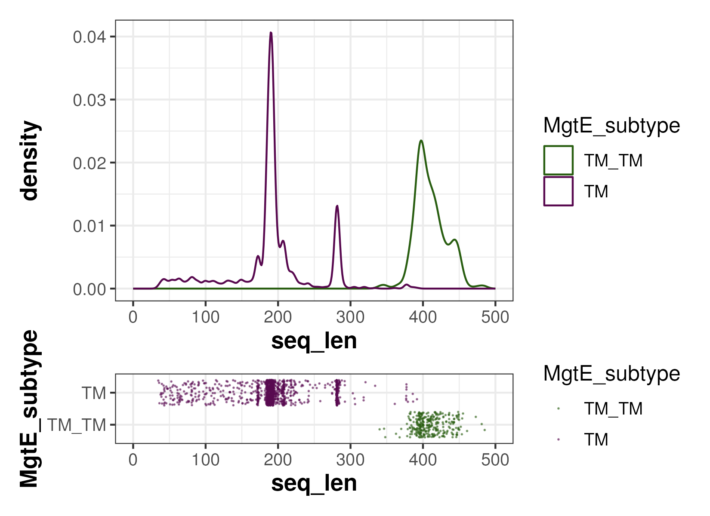

# mgte_short


<!-- Codes were shared with https://github.com/0mae/cpnet/tree/reborn -->

# Set environments

## Set variables and functions

``` {sh}
#| label: set_variables_and_functions
# For PBS
Email=XXX
# Project home directory
Home=$PWD
# print columns
function pri_col () {
    head -n1 $1 | sed 's/\t/\n/g' | awk '{print NR,$1}'
}
# check table header
function hd_check () {
    head $1 | column -t -s "$(printf '\011')"
}
```

## R container: bio_4.3.2

- `bio_4.3.2` is the primary R image used for most of the analysis. It
  was built from this [Dockerfile](Dockerfile).

``` {sh}
#| label: build_container
User=XXX
docker image build -t $User/bio_4.3.2 .
```

### Run RStudio Server

- Run following command and access to http://localhost:8787
  - username: `rstudio`

``` {sh}
#| label: run_rstudio_server
User=XXX
Pass=XXX
docker container run -p 8787:8787 -v ${PWD}:/home/rstudio -e PASSWORD=$Pass $User/bio_4.3.2
```

## Other software

- Used softwares available in SuperComputer System (CB202), Institue for
  Chemical Research, Kyoto University
  - https://www.scl.kyoto-u.ac.jp/index_e.html

``` {sh}
#| label: CB202
module load seqkit/0.16.1 R/4.1.2 CheckM/1.1.3 diamond/2.0.11 hmmer/3.3.2 blast+/2.12.0
```

## Rendering

- `Ctrl + Shift + K` at VSCode

- Or, run following command

``` {sh}
#| label: quarto_render
quarto render LOG.qmd
```

# Data collection

## Prepare GTDB

- Prokaryotic proteomes were downloaded from
  [GTDB](https://gtdb.ecogenomic.org/) (Release 06-RS202)
  - Files were downloaded to `db/gtdb_release202`

``` {sh}
#| label: data_collection
mkdir -p raw/gtdb/

# Extract ar122_metadata_r202.tsv and bac120_metadata_r202.tsv
tar -zxvf db/gtdb_release202/ar122_metadata_r202.tar.gz -C raw/gtdb/
tar -zxvf db/gtdb_release202/bac120_metadata_r202.tar.gz -C raw/gtdb/

# Extract genomes, proteins and gene sequences from GTDB
# Performed with qsub (resources_used.vmem=357380kb;resources_used.walltime=00:38:52)
tar -zxvf db/gtdb_release202/genomic_files_reps/gtdb_proteins_aa_reps_r202.tar.gz -C raw/gtdb/
tar -zxvf db/gtdb_release202/genomic_files_reps/gtdb_proteins_nt_reps_r202.tar.gz -C raw/gtdb/
tar -zxvf db/gtdb_release202/genomic_files_reps/gtdb_genomes_reps_r202.tar.gz -C raw/gtdb/

#cp db/gtdb_release202/genomic_files_reps/ar122_ssu_reps_r202.tar.gz raw/gtdb/
#cp db/gtdb_release202/genomic_files_reps/bac120_ssu_reps_r202.tar.gz raw/gtdb/
#tar -zxvf raw/gtdb/ar122_ssu_reps_r202.tar.gz -C raw/gtdb/
#tar -zxvf raw/gtdb/bac120_ssu_reps_r202.tar.gz -C raw/gtdb/
```

## Retrieve HQ genomes

- Retrieval of only high-quality (HQ) representative genomes
  - Completeness \>= 95%
  - Contamination \<= 5%

### Retrieve p\_\_Patescibacteria (CPR) HQ genomes

- The genome quality of CPR was estimated by using [custom marker
  set](https://github.com/Ecogenomics/CheckM/tree/master/custom_marker_sets/)
  provided by
  [CheckM](https://github.com/Ecogenomics/CheckM/tree/master)

``` {r}
#| label: retrieve_hq_genomes_cpr_metadata
library(tidyverse)

# Load GTDB genome metadata table with slight modification (GTDB tax path is splited into separate columns)
df_bac <- read.csv("raw/gtdb/bac120_metadata_r202.tsv", header = TRUE, sep = "\t", quote = "")
df_bac_tax <- df_bac %>% as_tibble() %>% mutate(gtdb_taxonomy_copy = gtdb_taxonomy) %>%
    separate(gtdb_taxonomy_copy, into = c("Domain", "Phylum", "Class", "Order", "Family", "Genus", "Species"), sep = ";", extra = "drop")

# Retrieve all CPR genomes
df_cpr <- df_bac_tax %>% filter(Phylum == "p__Patescibacteria", gtdb_representative == "t")

write.table(df_cpr %>% select(accession), "data/gtdb/cpr_metadata.tsv", row.names = FALSE, col.names = FALSE, sep = "\t", quote = FALSE)
```

``` {sh}
#| label: retrieve_hq_genomes_cpr
mkdir -p data/gtdb/cpr_genomes_reps

# Copy CPR protein files into one directory
# Performed with qsub (resources_used.vmem=0kb;resources_used.walltime=00:00:05)
cat data/gtdb/cpr_metadata.tsv | \
  sed 's/^GB_//; s/^RS_//; s/$/_genomic.fna.gz/' | sort | \
  join -1 1 -2 1 -a 1 - raw/gtdb/gtdb_genomes_reps_r202/genome_paths.tsv | awk '{print $2}' | \
  xargs -I {} -P 8 -n 1 sh -c "cp raw/gtdb/gtdb_genomes_reps_r202/{}*_genomic.fna.gz data/gtdb/cpr_genomes_reps/"

# Download marker sets of CPR Pfam hmm files
cp ../../tools/CheckM/custom_marker_sets/cpr_43_markers.hmm raw/gtdb/
cp ../../tools/CheckM/custom_marker_sets/cpr_43_markers.xlxs raw/gtdb/

# Perform CheckM
mkdir -p data/gtdb/cpr_checkm

# Thaw gzip genomes resources_used.vmem=0kb;resources_used.walltime=00:00:04
find data/gtdb/cpr_genomes_reps/ -name "*.fna.gz" | xargs -I {} -P 8 -n 1 sh -c "gzip -d {}"

# Perform CheckM 
# With qsub (resources_used.vmem=16491020kb;resources_used.walltime=00:14:50)
checkm analyze -x fna -t 12 raw/gtdb/cpr_43_markers.hmm data/gtdb/cpr_genomes_reps data/gtdb/cpr_checkm

# Generate tsv 
# With qsub (resources_used.vmem=837812kb;resources_used.walltime=00:01:54)
checkm qa --tab_table raw/gtdb/cpr_43_markers.hmm data/gtdb/cpr_checkm > data/gtdb/checkm_result_cpr.tsv

# Gzip genomes agein
find data/gtdb/cpr_genomes_reps/ -name "*.fna" | xargs -I {} -P 8 -n 1 sh -c "gzip {}"

# Slight modification for processing in R
cat data/gtdb/checkm_result_cpr.tsv | sed '1,6d; $d' | \
  sed '1s/# //g; 1s/Bin Id/accession/; 1s/Completeness/cpr_completeness/; 1s/Contamination/cpr_contamination/; 2,$s/_genomic//; 2,$s/^GCA/GB_GCA/; 2,$s/^GCF/RS_GCF/' > data/gtdb/cpr_completeness_contamination.tsv
```

### Retrieve all HQ genomes

- Total HQ genomes: 27,742
  - Bacteria: 26,841
    - Bacteria (excluding CPR): 25,877
    - CPR: 964
  - Archaea: 901

``` {r}
#| label: retrieve_hq_genomes
library(tidyverse)

#Rscript --vanilla --slave scripts/r/genomes_analyzed.R
df_bac <- read.csv("raw/gtdb/bac120_metadata_r202.tsv", header = TRUE, sep = "\t", quote = "")
df_ar <- read.csv("raw/gtdb/ar122_metadata_r202.tsv", header = TRUE, sep = "\t", quote = "")
df_ar_tax <- df_ar %>% as_tibble() %>% mutate(gtdb_taxonomy_copy = gtdb_taxonomy) %>%
    separate(gtdb_taxonomy_copy, into = c("Domain", "Phylum", "Class", "Order", "Family", "Genus", "Species"), sep = ";", extra = "drop")
df_bac_tax <- df_bac %>% as_tibble() %>% mutate(gtdb_taxonomy_copy = gtdb_taxonomy) %>%
    separate(gtdb_taxonomy_copy, into = c("Domain", "Phylum", "Class", "Order", "Family", "Genus", "Species"), sep = ";", extra = "drop")

# Retrieve representative high-quality (completeness >= 95%, contamination <= 5%) genomes
df_ar_hq <- df_ar_tax %>% filter(gtdb_representative == "t", checkm_completeness >= 95, checkm_contamination <= 5)
df_bac_hq <- df_bac_tax %>% filter(gtdb_representative == "t", checkm_completeness >= 95, checkm_contamination <= 5)

# Retrieve CPR representative genomes
df_cpr <- df_bac_tax %>% filter(Phylum == "p__Patescibacteria", gtdb_representative == "t")

# Load CheckM result using CPR marker set
df_cpr_cm <- read.csv("data/gtdb/cpr_completeness_contamination.tsv", header = TRUE, sep = "\t", quote = "") %>% as_tibble()

# Retrieve CPR representative high-quality (based on CPR marker set) genomes
df_cpr_hq <- df_cpr_cm %>% filter(cpr_completeness >= 95, cpr_contamination <= 5)

# Merge CPR representative high-quality (based on CPR marker set) genomes and others
# Retrieve representative high-quality CPR genome rows from GTDB metadata table
df_bac_tax_cpr <- column_to_rownames(df_bac_tax, "accession")[df_cpr_hq$accession,] %>% rownames_to_column("accession") %>% as_tibble()
df_bac_tax_cpr2 <- cbind(df_bac_tax_cpr, df_cpr_hq[c("cpr_completeness", "cpr_contamination")]) %>% as_tibble()
# Retrieve representative high=quality genomes other than CPR
df_bac_tax_non_cpr <- df_bac_hq %>% filter(Phylum != "p__Patescibacteria") %>% mutate(cpr_completeness = NA, cpr_contamination = NA)
# Merge with CPRs and generate final genome data set to analyze
df_bac_hq_merged <- rbind(df_bac_tax_non_cpr, df_bac_tax_cpr2) %>% as_tibble()
# Archaea was not modified
df_ar_hq_merged <- df_ar_hq %>% mutate(cpr_completeness = NA, cpr_contamination = NA)

# Output
write.table(df_bac_hq_merged, "data/tsv/genomes_analyzed_bac.tsv", row.names = FALSE, col.names = TRUE, sep = "\t", quote = FALSE)
write.table(df_ar_hq_merged, "data/tsv/genomes_analyzed_ar.tsv", row.names = FALSE, col.names = TRUE, sep = "\t", quote = FALSE)
```

- Make HQ genomes list

``` {sh}
#| label: make_hq_genomes_list
mkdir -p suppl
cat data/tsv/genomes_analyzed_bac.tsv | cut -f 1,111-117 > suppl/hq_genomes_list_bac.tsv
cat data/tsv/genomes_analyzed_ar.tsv | cut -f 1,111-117 > suppl/hq_genomes_list_ar.tsv
```

## Retrieve proteomes

- The number of raw protein (gene) sequences: 105,323,091

``` {sh}
#| label: retrieve_proteomes
# Make tsv with genomic accession, prodigal info and sequences
# Performed with qsub (resources_used.vmem=2793844kb;resources_used.walltime=00:52:28)
(cat data/tsv/genomes_analyzed_bac.tsv | cut -f 1 | tail -n +2 | xargs -I {} sh -c "cat raw/gtdb/protein_faa_reps/bacteria/{}_protein.faa | seqkit fx2tab | sed 's/^/{}\t/'"; \
  cat data/tsv/genomes_analyzed_ar.tsv | cut -f 1 | tail -n +2 | xargs -I {} sh -c "cat raw/gtdb/protein_faa_reps/archaea/{}_protein.faa | seqkit fx2tab | sed 's/^/{}\t/'") | \
  sed 's/ # /\t/g; s/ID=/\t/; s/;partial=/\t/; s/;start_type=/\t/; s/;rbs_motif=/\t/; s/;rbs_spacer=/\t/; s/;gc_cont=/\t/'protein_names2tsv | \
  sed '1s/^/accession\tprodigal_acc\tprodigal_start\tprodigal_end\tprodigal_strand\t\tprodigal_ID\tprodigal_partial\tprodigal_start_type\tprodigal_rbs_motif\tprodigal_rbs_spacer\tprodigal_gc_cont\tprotein_seq\n/' > data/tsv/proteins_raw.tsv

# Generate FASTA file
# Performed with qsub (resources_used.vmem=1278176kb;resources_used.walltime=00:05:16)
mkdir -p data/seqs
cat data/tsv/proteins_raw.tsv | tail -n +2 | cut -f 2,13 | seqkit tab2fx > data/seqs/proteins_raw.faa

# The number of raw protein (gene) sequences
cat data/tsv/proteins_raw.tsv | tail -n +2 | wc -l
# 105323091
cat data/seqs/proteins_raw.faa | grep '^>' | wc -l
# 105323091

# Sort protein tsv file, first
# Performed with qsub (~30 min)
cut -f 2,13 data/tsv/proteins_raw.tsv | tail -n +2 | sort -k 1,1 | gzip > data/tsv/proteins_raw_seq_sorted.tsv.gz

# Merge proteins and genomes
# Performed with qsub (resources_used.vmem=10748396kb;resources_used.walltime=00:41:53)
cat data/tsv/genomes_analyzed_ar.tsv <(tail -n +2 data/tsv/genomes_analyzed_bac.tsv) | \
    cut -f 1,111-117 | \
    sort -k 1,1 | \
    join -t "$(printf '\011')" -1 1 -2 1 -a 1 <(
        sort -k 1,1 data/tsv/proteins_raw.tsv | perl -ne 's/\t$//; print'
    ) - > data/tsv/proteins_raw_gtdbtax.tsv

# Prepare sorted proteins_raw_gtdbtax.tsv
# Perform with qsub (resources_used.vmem = 30296kb;resources_used.walltime = 00:05:32)
cat data/tsv/proteins_raw_gtdbtax.tsv | cut -f 1,2,14-20 | sed '1s/prodigal_acc/000_prodigal_acc/' | \
  sort -k 2,2 | gzip > data/tsv/proteins_raw_gtdbtax_sorted_mini.tsv.gz
```

## Split proteomes

- Split raw protein FASTA into 250 chunks
  - ~421K sequences/chunk

``` {sh}
#| label: split_proteomes
mkdir -p data/seqs_split

# Split proteomes into 250 chunks
# Performed with qsub (resources_used.vmem=735088kb;resources_used.walltime=00:09:35)
perl scripts/perl/split_fasta.pl 421293 data/seqs/proteins_raw.faa data/seqs_split 3

# Check sequence number
# Performed with qsub (resources_used.vmem=1062192kb;resources_used.walltime=00:16:07)
seqkit stats data/seqs/proteins_raw.faa
cat data/seqs_split/* | seqkit stats

cat qsub_out/check_split_fasta_o
<< EOF
file                        format  type        num_seqs         sum_len  min_len  avg_len  max_len
data/seqs/proteins_raw.faa  FASTA   Protein  105,323,091  33,820,703,569       20    321.1   58,166

file  format  type        num_seqs         sum_len  min_len  avg_len  max_len
-     FASTA   Protein  105,323,091  33,820,703,569       20    321.1   58,166
EOF
```

# Search MgtE

- Reference MgtE:
  - Thermus thermophilus TTHA1060 (UniProt:
    [Q5SMG8](https://www.uniprot.org/uniprotkb/Q5SMG8/entry))

## Search MgtE by Pfam

- MgtE Pfam domain:
  - [PF01769](https://www.ebi.ac.uk/interpro/entry/pfam/PF01769/)
    (Divalent cation transporter, MgtE)

``` {sh}
#| label: search_mgte_PF01769
# Get Pfam profiles
wget https://www.ebi.ac.uk/interpro/wwwapi//entry/pfam/PF01769?annotation=hmm -O raw/pfam/PF01769.hmm.gz

# Collect sequences
# Performed with qsub (A few seconds)
mkdir -p data/tsv/hmmsearch_PF01769
seq -w 0 249 | xargs -I {} -P 36 -n 1 sh -c "$HOME/tools/hmmer-3.3.2/src/hmmsearch --domtblout data/tsv/hmmsearch_PF01769/hmmsearch_PF01769.{}.txt raw/pfam/PF01769.hmm.gz data/seqs_split/proteins_raw.faa.{}"

# Make tsv format
seq -w 0 249 | xargs -I {} sh -c "grep -v '^#' data/tsv/hmmsearch_PF01769/hmmsearch_PF01769.{}.txt" | cat <(head -n3 data/tsv/hmmsearch_PF01769/hmmsearch_PF01769.001.txt) - > data/tsv/hmmsearch_PF01769.txt
bash scripts/bash/hmmsearch_tbl2tsv.sh data/tsv/hmmsearch_PF01769.txt > data/tsv/hmmsearch_PF01769.tsv

cat data/tsv/hmmsearch_PF01769.tsv | cut -f 1 | tail -n +2 | sort | uniq | wc -l
# 29775

# Remove temporal files
rm -rf data/tsv/hmmsearch_PF01769

# Retrieve FASTA
# Performed with qsub (~5 min)
mkdir -p data/seqs_pfam
tail -n +2 data/tsv/hmmsearch_PF01769.tsv | cut -f 1 | sort | uniq | \
  join -t "$(printf '\011')" -1 1 -2 1 -a 1 -o 1.1 2.2 - <(zcat data/tsv/proteins_raw_seq_sorted.tsv.gz) | \
  perl -ne 's/^/>/;s/\t/\n/;print' | \
  gzip > data/seqs_pfam/hmmsearch_PF01769.faa.gz

# Number of seqs
zcat data/seqs_pfam/hmmsearch_PF01769.faa.gz | grep '^>' | wc -l
# 29775
```

# MgtE domain architecture

## Find domains by InterProScan

- Assign protein domains by using InterPro
- `interproscan_range_num.R` was updated to
  `interproscan_assign_domains.R`!
  - `e_val` sores were ignored and assigned domains based only on
    overlapping ranges of each InterProID.
  - Hits without InterProIDs were discarded.

``` {sh}
#| label: interproscan
# Run interproscan
# Performed with qsub (resources_used.vmem = 37198236kb;resources_used.walltime = 01:05:36)
zcat data/seqs_pfam/hmmsearch_PF01769.faa.gz | sed 's/\*$//' > data/seqs_pfam/hmmsearch_PF01769.faa
$HOME/tools/interproscan/interproscan-5.63-95.0/interproscan.sh -o data/tsv/interproscan_PF01769.tsv -cpu 40 -i data/seqs_pfam/hmmsearch_PF01769.faa -f TSV --tempdir data/tsv/temp_PF01769

# Left only Interpro information
cat data/tsv/interproscan_PF01769.tsv | cut -f 1,3,7-9,12-15 | sed '1s/^/prot_acc\tseq_len\tstart\tend\te_val\tinterpro_acc\tinterpro_desc\n/' | gzip > data/tsv/interproscan_PF01769_interproID.tsv.gz

# Number of hits
cat data/tsv/interproscan_PF01769.tsv | wc -l
# 381293

# Number of hit seqs
zcat data/tsv/interproscan_PF01769_interproID.tsv.gz | tail -n +2 | cut -f 1 | sort | uniq | wc -l
# 28127

# Assign domains (Considering hit ranges)
# Performed with qsub (resources_used.vmem = 116872748kb;resources_used.walltime = 00:03:57)
singularity exec --bind $(pwd):/temp bio_4.3.2_latest.sif bash -c "cd /temp && Rscript --vanilla --slave scripts/r/interproscan_assign_domains.R data/tsv/interproscan_PF01769_interproID.tsv.gz 40 data/tsv/interproscan_PF01769_interproID_range_num_tophits.tsv"

gzip data/tsv/interproscan_PF01769_interproID_range_num_tophits.tsv
zcat data/tsv/interproscan_PF01769_interproID_range_num_tophits.tsv.gz | wc -l
# 165321

# Join GTDB tax
# Performed with qsub (resources_used.vmem = 38688kb;resources_used.walltime = 00:02:43)
zcat data/tsv/interproscan_PF01769_interproID_range_num_tophits.tsv.gz | sed '1s/prot_acc/000_prodigal_acc/' | sort -k 1,1 | \
  join -t "$(printf '\011')" -1 1 -2 2 -a 1 - <(zcat data/tsv/proteins_raw_gtdbtax_sorted_mini.tsv.gz | sort -k 2,2) | \
  sed '1s/000_prodigal_acc/prodigal_acc/' | gzip > data/tsv/interproscan_PF01769_interproID_range_num_tophits_gtdbtax.tsv.gz

zcat data/tsv/interproscan_PF01769_interproID_range_num_tophits_gtdbtax.tsv.gz | wc -l
# 165321
```

## Analyze MgtE domain architecture

- Domain classification
  - [IPR006667](https://www.ebi.ac.uk/interpro/entry/InterPro/IPR006667/)
    - SLC41A/MgtE, integral membrane domain (SLC41_membr_dom)
  - [IPR046342](https://www.ebi.ac.uk/interpro/entry/InterPro/IPR046342/)
    - CBS domain superfamily (CBS_dom_sf)
  - [IPR006668](https://www.ebi.ac.uk/interpro/entry/InterPro/IPR006668/)
    - Magnesium transporter, MgtE intracellular domain
      (Mg_transptr_MgtE_intracell_dom)

``` {r}
#| label: domain_classification
library(tidyverse)
library(ggupset)
source("scripts/r/theme_set_1.R")
system("mkdir -p png")

df_PF01769 <- read.csv("data/tsv/interproscan_PF01769_interproID_range_num_tophits_gtdbtax.tsv.gz", header = TRUE, sep = "\t", quote = "", na.strings=c("", "NULL", "-")) %>% as_tibble()

#### Classification based on domain composition ####
# Upset plot of Mg2 transporter three-partitioned domains ("IPR006667", "IPR046342", "IPR006668") organization
df_PF01769_MgtE <- df_PF01769 %>% group_by(prodigal_acc) %>% nest() %>% 
  mutate(MgtE_presence = map(data, ~ if (intersect(.x$interpro_acc, c("IPR006667")) %>% length() > 0) {TRUE})) %>% 
  unnest(MgtE_presence) %>% select(-MgtE_presence) %>% unnest(data) %>% ungroup()

interpro_acc_upset_3 <- function(df_interpro, interpro_ids) {
  p_interpro <- df_interpro %>% filter(interpro_acc %in% interpro_ids) %>% group_by(prodigal_acc) %>% 
    distinct(interpro_acc, short_name,interpro_desc) %>% ungroup() %>% 
    mutate(interpro_name = paste(short_name, interpro_acc,sep = "; ")) %>% 
    group_by(prodigal_acc) %>% summarize(interpro_names = list(interpro_name)) %>% 
    ggplot(aes(x = interpro_names)) + geom_bar() + scale_x_upset()
  return(p_interpro)
}

p_PF01769_MgtE_three_part <- interpro_acc_upset_3(df_PF01769_MgtE %>% filter(), c("IPR006667", "IPR046342", "IPR006668"))
ggsave(paste0("png/PF01769_MgtE_three_part_upset.png"), p_PF01769_MgtE_three_part, height = 3, width = 5, dpi = 300)

# The number of MgtE proteins
df_PF01769_MgtE_2 <- df_PF01769_MgtE %>% filter(interpro_acc %in% c("IPR006667", "IPR046342", "IPR006668")) %>%
  group_by(prodigal_acc,seq_len) %>% 
  distinct(interpro_acc,Domain,Phylum,Class,Order,Family,Genus,Species,accession) %>% ungroup() %>% 
  group_by(prodigal_acc,seq_len,Domain,Phylum,Class,Order,Family,Genus,Species,accession) %>% 
  summarize(interpro_names = list(interpro_acc)) %>%
  mutate(variant = map(
    interpro_names, ~ if (intersect(.x, c("IPR006667", "IPR046342", "IPR006668")) %>% length() == 3) {
      "MgtE"
    } else if (intersect(.x, c("IPR006667", "IPR046342")) %>% length() == 2) {
      "MgtE_dN"
    } else if (intersect(.x, c("IPR006667", "IPR006668")) %>% length() == 2) {
      "MgtE_dCBS"
    } else if (intersect(.x, c("IPR006667")) %>% length() == 1) {
      "MgtE_dCBS_dN"
    }
  )) %>% unnest(variant) %>% ungroup()
df_PF01769_MgtE_2$variant <- factor(df_PF01769_MgtE_2$variant, levels = rev(c("MgtE", "MgtE_dN", "MgtE_dCBS", "MgtE_dCBS_dN")))
p_PF01769_MgtE_2_prot <- df_PF01769_MgtE_2 %>% group_by(variant) %>% summarize(n_proteins = dplyr::n()) %>% 
  ggplot(aes(x = n_proteins, y = variant)) +
  geom_bar(stat = "identity")
ggsave(paste0("png/PF01769_MgtE_2_prot.png"), p_PF01769_MgtE_2_prot, height = 3, width = 3.5, dpi = 300)

# Table (Taxonomy)
df_PF01769_MgtE_2 %>% group_by(variant,Domain) %>% summarize(n_proteins = dplyr::n()) %>% 
  arrange(desc(variant)) %>% pivot_wider(names_from = "Domain", values_from = "n_proteins", values_fill = 0) %>% 
  mutate(Total = d__Archaea + d__Bacteria) %>% knitr::kable()

# MgtE protein length
set.seed(1234)
p_PF01769_MgtE_2_len <- df_PF01769_MgtE_2 %>%
  ggplot(aes(x = seq_len, y = variant)) +
  geom_point(position = position_jitter(), color = "grey70", alpha = 0.5, size = 0.01) +
  geom_violin(fill = "grey90", draw_quantiles = c(0.5)) 
ggsave(paste0("png/PF01769_MgtE_2_len.png"), p_PF01769_MgtE_2_len, height = 3, width = 3.5, dpi = 300)

# Table
df_PF01769_MgtE_2 %>% group_by(variant) %>% 
  summarize(len_min = min(seq_len), len_max = max(seq_len), len_mean = mean(seq_len), len_median = median(seq_len)) %>% 
  arrange(desc(variant)) %>% knitr::kable()
```

- Domain composition


- The number of proteins


| variant      | d\_\_Archaea | d\_\_Bacteria | Total |
|:-------------|-------------:|--------------:|------:|
| MgtE         |           82 |         19690 | 19772 |
| MgtE_dN      |           71 |           979 |  1050 |
| MgtE_dCBS    |            0 |            11 |    11 |
| MgtE_dCBS_dN |          964 |           591 |  1555 |

- Length of proteins


| variant      | len_min | len_max | len_mean | len_median |
|:-------------|--------:|--------:|---------:|-----------:|
| MgtE         |     222 |     781 | 459.9193 |        456 |
| MgtE_dN      |     148 |     559 | 345.4229 |        337 |
| MgtE_dCBS    |     239 |     546 | 363.0909 |        308 |
| MgtE_dCBS_dN |      35 |     485 | 234.5961 |        193 |

- Detailed domain architecture

``` {r}
#| label: domain_architecture
library(tidyverse)
library(patchwork)
library(Biostrings)
source("scripts/r/theme_set_1.R")

df_PF01769 <- read.csv("data/tsv/interproscan_PF01769_interproID_range_num_tophits_gtdbtax.tsv.gz", header = TRUE, sep = "\t", quote = "", na.strings=c("", "NULL", "-")) %>% as_tibble()

#### Classification based on domain composition ####
# Upset plot of Mg2 transporter three-partitioned domains ("IPR006667", "IPR046342", "IPR006668") organization
df_PF01769_MgtE <- df_PF01769 %>% group_by(prodigal_acc) %>% nest() %>% 
  mutate(MgtE_presence = map(data, ~ if (intersect(.x$interpro_acc, c("IPR006667")) %>% length() > 0) {TRUE})) %>% 
  unnest(MgtE_presence) %>% select(-MgtE_presence) %>% unnest(data) %>% ungroup()

# The number of MgtE proteins
df_PF01769_MgtE_2 <- df_PF01769_MgtE %>% filter(interpro_acc %in% c("IPR006667", "IPR046342", "IPR006668")) %>%
  group_by(prodigal_acc,seq_len) %>% 
  distinct(interpro_acc,Domain,Phylum,Class,Order,Family,Genus,Species,accession) %>% ungroup() %>% 
  group_by(prodigal_acc,seq_len,Domain,Phylum,Class,Order,Family,Genus,Species,accession) %>% 
  summarize(interpro_names = list(interpro_acc)) %>%
  mutate(variant = map(
    interpro_names, ~ if (intersect(.x, c("IPR006667", "IPR046342", "IPR006668")) %>% length() == 3) {
      "MgtE"
    } else if (intersect(.x, c("IPR006667", "IPR046342")) %>% length() == 2) {
      "MgtE_dN"
    } else if (intersect(.x, c("IPR006667", "IPR006668")) %>% length() == 2) {
      "MgtE_dCBS"
    } else if (intersect(.x, c("IPR006667")) %>% length() == 1) {
      "MgtE_dCBS_dN"
    }
  )) %>% unnest(variant) %>% ungroup()
df_PF01769_MgtE_2$variant <- factor(df_PF01769_MgtE_2$variant, levels = rev(c("MgtE", "MgtE_dN", "MgtE_dCBS", "MgtE_dCBS_dN")))

#### Define domain architecture ####
df_PF01769_MgtE_3 <- df_PF01769_MgtE %>% 
  group_by(prodigal_acc,seq_len,accession,Domain,Phylum,Class,Order,Family,Genus,Species) %>% 
  summarize(interpro_acc_rng = list(paste(interpro_acc, range_num, sep = "_"))) %>% 
 mutate(MgtE_subtype = map(
   interpro_acc_rng, ~ if (length(intersect(.x, c("IPR006667_1", "IPR046342_1", "IPR006668_1", "IPR006668_2"))) == 4) {
     "TM_CBS_N_N"
   } else if (length(intersect(.x, c("IPR006667_1", "IPR046342_1", "IPR006668_1"))) == 3) {
     "TM_CBS_N"
   } else if (length(intersect(.x, c("IPR006667_1", "IPR006668_1", "IPR006668_2"))) == 3) {
     "TM_N_N"
   } else if (length(intersect(.x, c("IPR006667_1", "IPR046342_1"))) == 2) {
     "TM_CBS"
   } else if (length(intersect(.x, c("IPR006667_1", "IPR006667_2"))) == 2) {
     "TM_TM"
   } else if (length(intersect(.x, c("IPR006667_1", "IPR006668_1"))) == 2) {
     "TM_N"
   } else if (length(intersect(.x, c("IPR006667_1"))) == 1) {
     "TM"
   } else {
     "Others"
   }
 )) %>% unnest(MgtE_subtype) %>% ungroup()
df_PF01769_MgtE_3$MgtE_subtype <- factor(df_PF01769_MgtE_3$MgtE_subtype, levels = rev(c("TM_CBS_N", "TM_CBS_N_N", "TM_CBS", "TM_N", "TM_N_N", "TM", "TM_TM", "Others")))

# Export domain architecture tsv
# Load aa sequences
seq_PF01769 <- readAAStringSet("data/seqs_pfam/hmmsearch_PF01769.faa.gz", "fasta")
# Combine
df_domain_architecture <- df_PF01769_MgtE_3 %>% 
  select(prodigal_acc,seq_len,MgtE_subtype,accession,Domain,Phylum,Species) %>% 
  mutate(seq = seq_PF01769[df_PF01769_MgtE_3$prodigal_acc] %>% as.character)
# Export
write.table(df_domain_architecture, "suppl/MgtE_domain_architecture.tsv", row.names = FALSE, col.names = TRUE, sep = "\t", quote = FALSE)
# Compress
system("cat suppl/MgtE_domain_architecture.tsv | gzip > suppl/MgtE_domain_architecture.tsv.gz && rm suppl/MgtE_domain_architecture.tsv")

#### Domain architecture of MgtE_dCBS_dN ####
acc_tm_only <- df_PF01769_MgtE_2 %>% filter(variant == "MgtE_dCBS_dN") %>% select(prodigal_acc) %>% pull()

df_PF01769_MgtE_dCBS_dN <- df_PF01769_MgtE_3 %>% 
  filter(prodigal_acc %in% acc_tm_only)

# Table (Number of proteins)
df_PF01769_MgtE_dCBS_dN %>% group_by(MgtE_subtype,Domain) %>% summarize(n_proteins = dplyr::n()) %>%
  pivot_wider(names_from = "Domain", values_from = "n_proteins", values_fill = 0) %>% 
  arrange(desc(MgtE_subtype)) %>%
  mutate(Total = d__Archaea + d__Bacteria) %>% knitr::kable()

# Length of MgtE subtypes
# set.seed(1234)
# PF01769_MgtE_dCBS_dN_len <- df_PF01769_MgtE_dCBS_dN %>% 
#   ggplot(aes(x = seq_len, y = fct_rev(MgtE_subtype))) +
#   geom_point(position = position_jitter(), color = "grey70", alpha = 0.5, size = 0.01) +
#   geom_violin(fill = "grey90", draw_quantiles = c(0.5)) 
# ggsave(paste0("png/PF01769_MgtE_dCBS_dN_len.png"), PF01769_MgtE_dCBS_dN_len, height = 3, width = 3.5, dpi = 300)
# Density
PF01769_MgtE_dCBS_dN_len_dens <- df_PF01769_MgtE_dCBS_dN %>%
  ggplot(aes(x = seq_len, color = MgtE_subtype)) +
  geom_density() +
  xlim(0,500) +
  scale_color_manual(values = color_gp)
# Point
set.seed(1234)
PF01769_MgtE_dCBS_dN_len_point <- df_PF01769_MgtE_dCBS_dN %>%
  ggplot(aes(x = seq_len, y = MgtE_subtype, color = MgtE_subtype)) +
  geom_point(position = position_jitter(), alpha = 0.5, size = 0.01) +
  xlim(0,500) +
  scale_color_manual(values = color_gp)
# Combine
PF01769_MgtE_dCBS_dN_len <- 
  (PF01769_MgtE_dCBS_dN_len_dens / PF01769_MgtE_dCBS_dN_len_point) + plot_layout(heights = c(4, 1))
# Export
ggsave(paste0("png/PF01769_MgtE_dCBS_dN_len.png"), PF01769_MgtE_dCBS_dN_len, height = 4, width = 5.5, dpi = 300)

# Table
df_PF01769_MgtE_dCBS_dN %>% group_by(MgtE_subtype) %>% 
  summarize(len_min = min(seq_len), len_max = max(seq_len), len_mean = mean(seq_len), len_median = median(seq_len)) %>% 
  arrange(desc(MgtE_subtype)) %>% knitr::kable()

#### Export MgtE_dCBS_dN tsv ####
# # Load aa sequences
# seq_PF01769 <- readAAStringSet("data/seqs_pfam/hmmsearch_PF01769.faa.gz", "fasta")
# Combine
df_PF01769_MgtE_dCBS_dN_tsv <- df_PF01769_MgtE_dCBS_dN %>%
  select(prodigal_acc,seq_len,MgtE_subtype,accession,Domain,Phylum,Species) %>%
  mutate(seq = seq_PF01769[df_PF01769_MgtE_dCBS_dN$prodigal_acc] %>% as.character)
# Export
write.table(df_PF01769_MgtE_dCBS_dN_tsv, "suppl/MgtE_dCBS_dN.tsv", row.names = FALSE, col.names = TRUE, sep = "\t", quote = FALSE)
```

- The number of proteins

| MgtE_subtype | d\_\_Archaea | d\_\_Bacteria | Total |
|:-------------|-------------:|--------------:|------:|
| TM           |          723 |           526 |  1249 |
| TM_TM        |          241 |            65 |   306 |

- Length of proteins



| MgtE_subtype | len_min | len_max | len_mean | len_median |
|:-------------|--------:|--------:|---------:|-----------:|
| TM           |      35 |     392 | 191.5572 |        191 |
| TM_TM        |     340 |     485 | 410.2680 |        407 |
